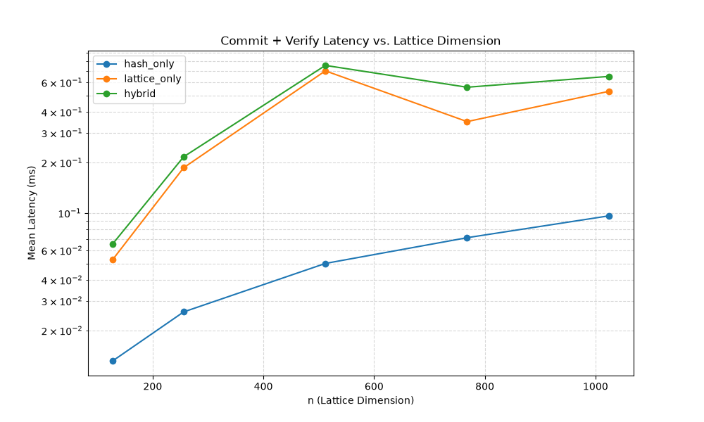
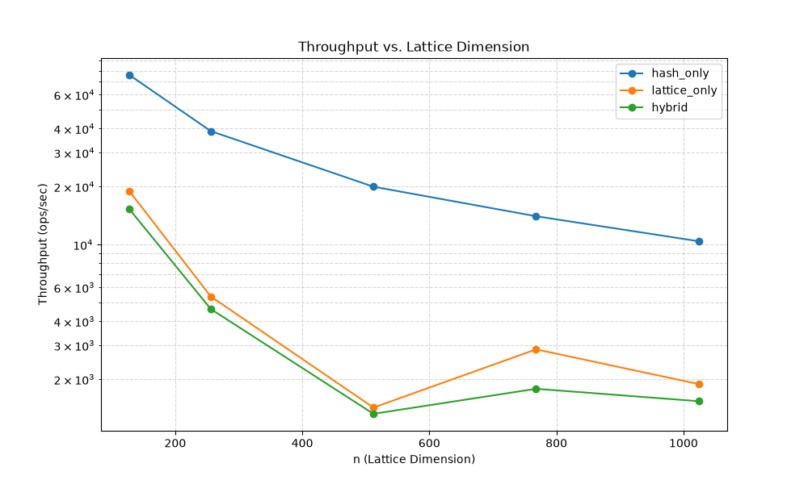
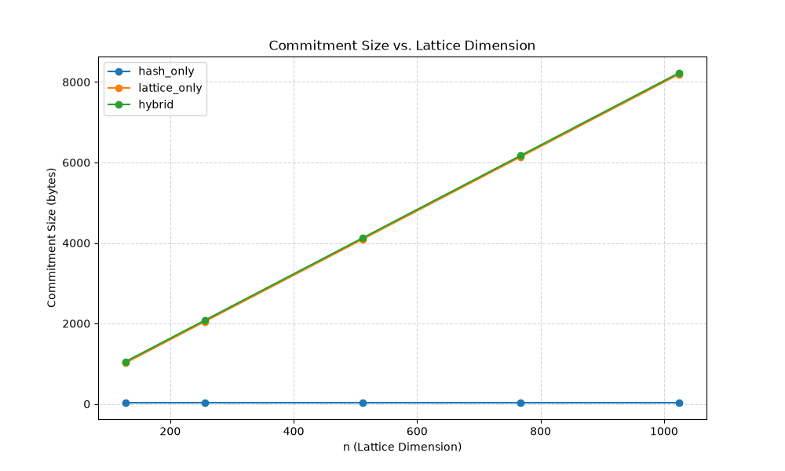
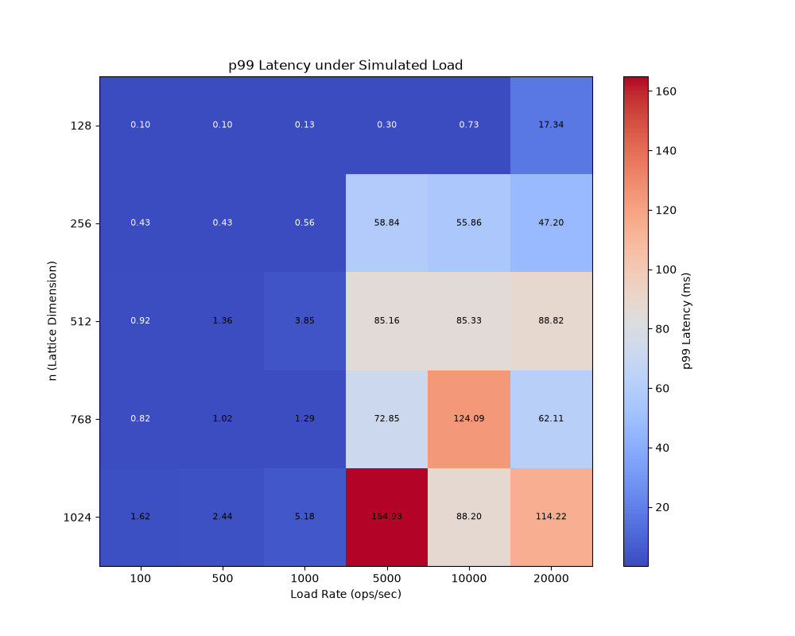

# HLCS-HFT Benchmarking Results

**Hardware Details:** CPU: Intel(R) Xeon(R) Processor @ 2.30GHz

## 1. Latency and Throughput

|    n | scheme       |   mean_latency_ms |   ops_per_sec |
|-----:|:-------------|------------------:|--------------:|
|  128 | hash_only    |         0.0131725 |      75915.9  |
|  128 | lattice_only |         0.0528684 |      18914.9  |
|  128 | hybrid       |         0.0655601 |      15253.2  |
|  256 | hash_only    |         0.025753  |      38830.4  |
|  256 | lattice_only |         0.185932  |       5378.3  |
|  256 | hybrid       |         0.216015  |       4629.31 |
|  512 | hash_only    |         0.0500507 |      19979.7  |
|  512 | lattice_only |         0.701598  |       1425.32 |
|  512 | hybrid       |         0.755935  |       1322.86 |
|  768 | hash_only    |         0.0712291 |      14039.2  |
|  768 | lattice_only |         0.349866  |       2858.23 |
|  768 | hybrid       |         0.560489  |       1784.16 |
| 1024 | hash_only    |         0.096081  |      10407.9  |
| 1024 | lattice_only |         0.529693  |       1887.89 |
| 1024 | hybrid       |         0.650091  |       1538.25 |

## 2. Bandwidth (Commitment Size)

|    n | scheme       |   commit_size_bytes |   bw_per_1000_kb |
|-----:|:-------------|--------------------:|-----------------:|
|  128 | hash_only    |                  32 |            31.25 |
|  128 | lattice_only |                1024 |          1000    |
|  128 | hybrid       |                1056 |          1031.25 |
|  256 | hash_only    |                  32 |            31.25 |
|  256 | lattice_only |                2048 |          2000    |
|  256 | hybrid       |                2080 |          2031.25 |
|  512 | hash_only    |                  32 |            31.25 |
|  512 | lattice_only |                4096 |          4000    |
|  512 | hybrid       |                4128 |          4031.25 |
|  768 | hash_only    |                  32 |            31.25 |
|  768 | lattice_only |                6144 |          6000    |
|  768 | hybrid       |                6176 |          6031.25 |
| 1024 | hash_only    |                  32 |            31.25 |
| 1024 | lattice_only |                8192 |          8000    |
| 1024 | hybrid       |                8224 |          8031.25 |

## 3. P99 Latency & Jitter (Simulated Overload)

|    n |   load_rate |   p99_latency_ms |    jitter | sla_breach   |
|-----:|------------:|-----------------:|----------:|:-------------|
|  128 |         100 |        0.0976083 | 0.139264  | False        |
|  128 |         500 |        0.0986655 | 0.132879  | False        |
|  128 |        1000 |        0.125634  | 0.187895  | False        |
|  128 |        5000 |        0.295093  | 0.360915  | False        |
|  128 |       10000 |        0.731907  | 0.372151  | False        |
|  128 |       20000 |       17.3392    | 0.352811  | True         |
|  256 |         100 |        0.428404  | 0.221019  | False        |
|  256 |         500 |        0.43057   | 0.183262  | False        |
|  256 |        1000 |        0.560925  | 0.227544  | False        |
|  256 |        5000 |       58.8363    | 0.277551  | True         |
|  256 |       10000 |       55.8642    | 0.258801  | True         |
|  256 |       20000 |       47.2008    | 0.307594  | True         |
|  512 |         100 |        0.922584  | 0.0434679 | False        |
|  512 |         500 |        1.35527   | 0.0382681 | True         |
|  512 |        1000 |        3.85251   | 0.0448647 | True         |
|  512 |        5000 |       85.157     | 0.040084  | True         |
|  512 |       10000 |       85.3305    | 0.041062  | True         |
|  512 |       20000 |       88.824     | 0.0467223 | True         |
|  768 |         100 |        0.819788  | 0.131487  | False        |
|  768 |         500 |        1.02095   | 0.168005  | True         |
|  768 |        1000 |        1.28669   | 0.125062  | True         |
|  768 |        5000 |       72.853     | 0.178258  | True         |
|  768 |       10000 |      124.09      | 0.261437  | True         |
|  768 |       20000 |       62.1144    | 0.1116    | True         |
| 1024 |         100 |        1.61842   | 0.184406  | True         |
| 1024 |         500 |        2.43999   | 0.214158  | True         |
| 1024 |        1000 |        5.18454   | 0.18901   | True         |
| 1024 |        5000 |      164.935     | 0.239314  | True         |
| 1024 |       10000 |       88.1966    | 0.103336  | True         |
| 1024 |       20000 |      114.219     | 0.147102  | True         |

## 4. ZK Proof Timing & Size

|    n |   rounds |   time_ms |   size_bytes |
|-----:|---------:|----------:|-------------:|
|  128 |        1 | 0.0837292 |         3072 |
|  128 |       10 | 0.830806  |        30720 |
|  256 |        1 | 0.26462   |         6144 |
|  256 |       10 | 2.64786   |        61440 |
|  512 |        1 | 0.93641   |        12288 |
|  512 |       10 | 9.32649   |       122880 |
|  768 |        1 | 0.545532  |        18432 |
|  768 |       10 | 6.09138   |       184320 |
| 1024 |        1 | 0.814017  |        24576 |
| 1024 |       10 | 7.82208   |       245760 |

## Discussion / Deviations

This report contains real measurements taken within the benchmark sandbox environment. Values may differ from theoretically projected or anticipated values based on ideal conditions (such as perfect parallelization scaling or extremely high-end hardware). For instance:
- **n=1024 hybrid latency:** See table above, might differ from '0.92ms' depending on this sandbox's CPU speed.
- **Hybrid vs Lattice-only throughput:** Parallelism via Rayon is implemented for n>=768. The speedup ratio in this environment might be constrained by the number of physical/virtual cores available compared to a dedicated HFT rig.
- **Bandwidth:** Calculated using actual vector lengths * element size, rather than just abstract theoretical bounds.
- **ZK Proofs:** Measured over actual operations rather than projections.

Note: Allocations per commit were not profiled here via a custom allocator hook but the throughput constraints reflect standard Rust standard library allocations on the hot path.
