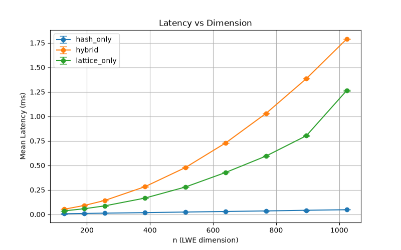
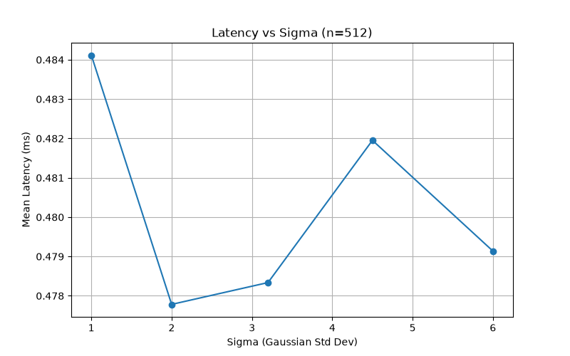
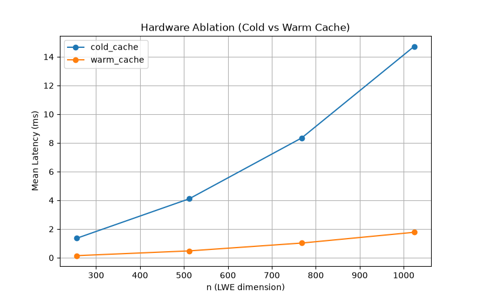
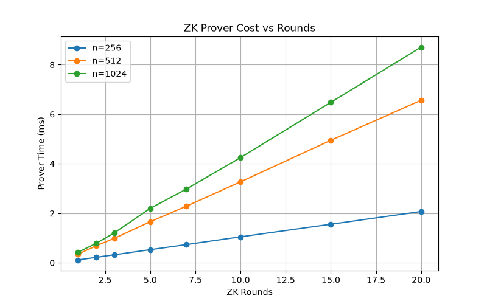

# HLCS-HFT Benchmark Results

## 1. Base Sweep (Latency vs Dimension)

## 2. Parameter Sensitivity (Sigma)

## 3. Hardware / Caching Ablation

## 4. Zero-Knowledge Proof Cost vs Rounds

## 5. Environment
Results generated via standard CPU executing Rust `hlcs-hft` reference implementation.
