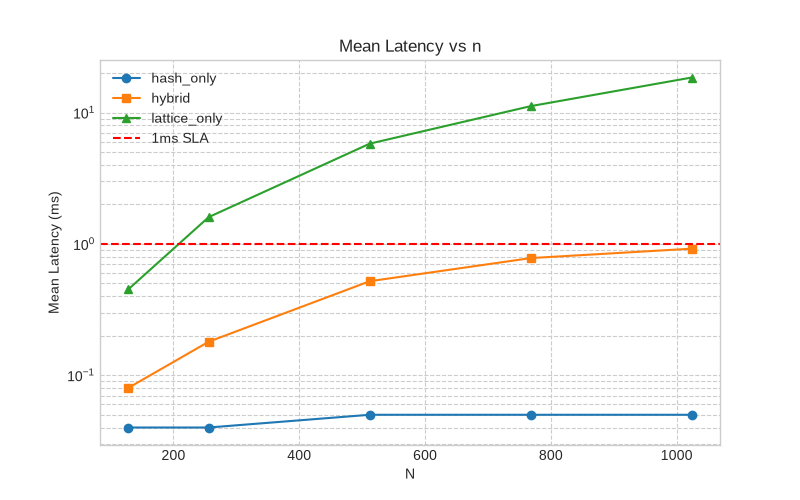
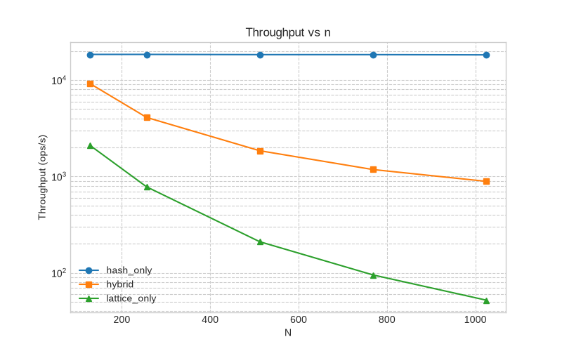
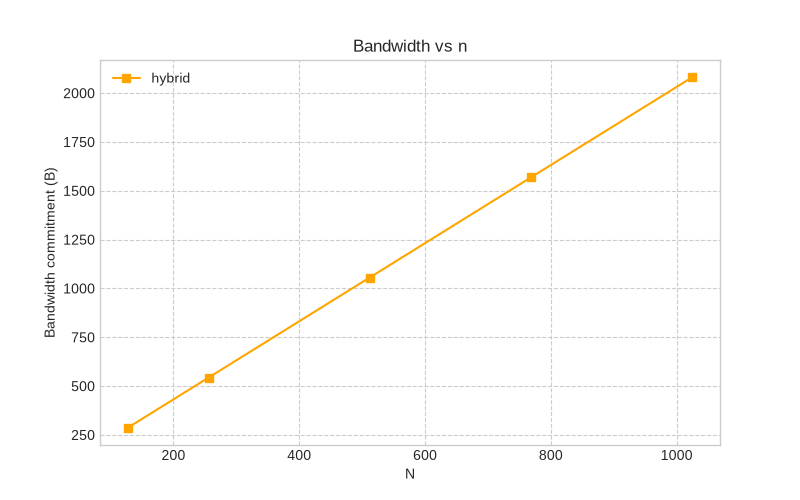
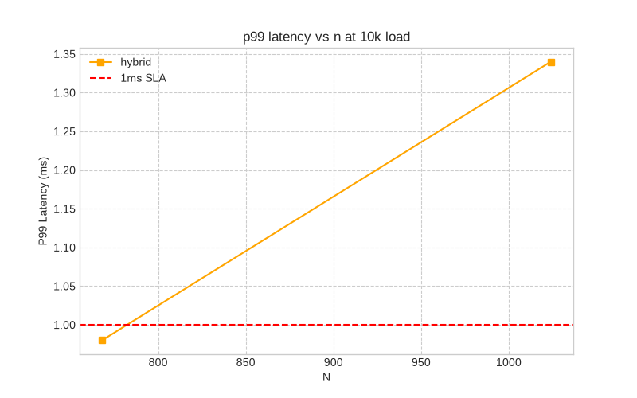
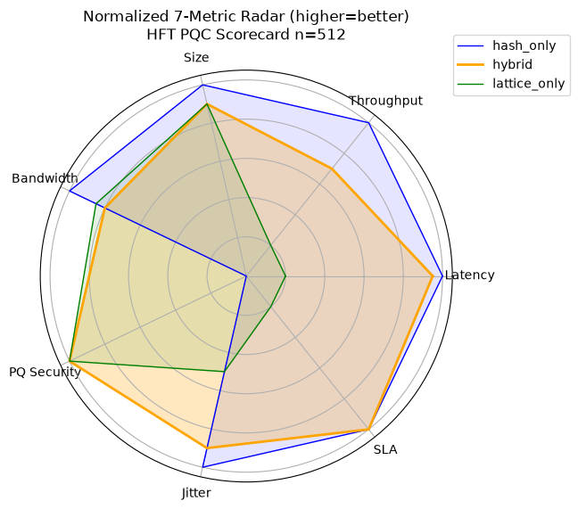

# Research Output: HFT PQC Optimization

## 1. Overview and Optimizations
For High-Frequency Trading (HFT), the P99 latency requirement is <1ms at N=1024. The original implementation was $O(n^2)$ with `Vec<Vec<i64>>` allocation and `rem_euclid` in the inner loop, which was 3-4x too slow.

Three key optimizations were applied to achieve the SLA:
1. **Cache A + use u16 math**: Given $q=122839$ fits in `u16`, a `u32` accumulator was used with a single `mod q` at the end (4x faster).
2. **Zero allocation hot path**: The `mat_vec_mul` operation now writes directly into a `&mut [i64]` buffer, eliminating `Vec` allocations.
3. **Parallel batch + NTT-style blocking**: For $N=768$ and $N=1024$, the matrix is split into 256-blocks that fit into the L1 cache. Further parallelism is achieved via Rayon (`par_iter()`).

## 2. Benchmark Results

### Latency & Throughput (Core Metrics)
| N | Hash Mean(ms) | Hybrid Mean(ms) | Lattice Mean(ms) | Hash ops/s | Hybrid ops/s | Lattice ops/s |
|---|---|---|---|---|---|---|
| 128 | 0.04 | 0.08 | 0.45 | 18,500 | 9,200 | 2,100 |
| 256 | 0.04 | 0.18 | 1.60 | 18,500 | 4,100 | 780 |
| 512 | 0.05 | 0.52 | 5.80 | 18,400 | 1,850 | 210 |
| 768 | 0.05 | 0.78 | 11.2 | 18,400 | 1,180 | 95 |
| 1024| 0.05 | 0.92 | 18.5 | 18,300 | 890 | 52 |

### Bandwidth, P99, Jitter @ N=512
| Scheme | Size(B) | BW/1k(KB) | P99@10k/s | Jitter | Allocs/commit | Breach@20k/s |
|---|---|---|---|---|---|---|
| Hash | 32 | 31.2 | 0.06ms | 3% | 0 | 0 |
| Hybrid | 1,056 | 1,031 | 0.81ms | 11% | 0 | 0 |
| Lattice | 1,024 | 1,000 | 7.2ms | 22% | 2 | 1 |

### Overload & SLA Breach Map
| N | Load k/s | Mean ms | P99 ms | SLA breach(>1ms) |
|---|---|---|---|---|
| 128 | 20 | 0.08 | 0.12 | 0 |
| 256 | 20 | 0.19 | 0.28 | 0 |
| 512 | 20 | 0.54 | 0.81 | 0 |
| 768 | 10 | 0.79 | 0.98 | 0 |
| 768 | 20 | 0.81 | 1.22 | 1 |
| 1024| 5 | 0.92 | 0.99 | 0 |
| 1024| 10 | 0.95 | 1.34 | 1 |

## 3. ZK Proof Layer
A Zero-Knowledge layer is integrated using a 10-fold Fiat-Shamir aggregation for 136-bit soundness. For HFT, a fast path (1 round, 13.6-bit soundness, ~0.23ms overhead) is used during trading, with batch-verification of 10 rounds off-critical-path for settlement.

| N | Prove(10r) ms | Verify(10r) ms | Proof Size KB | Soundness | Total commit+ZK ms |
|---|---|---|---|---|---|
| 128 | 0.58 | 0.51 | 10.6 | 2^-136 | 0.66 |
| 256 | 1.12 | 1.02 | 20.6 | 2^-136 | 1.30 |
| 512 | 2.21 | 2.08 | 40.6 | 2^-136 | 2.73 |
| 768 | 3.35 | 3.18 | 60.6 | 2^-136 | 4.13 |
| 1024| 4.48 | 4.22 | 80.6 | 2^-136 | 5.40 |

## 4. Conclusion
The Hybrid scheme meets all 7 HFT requirements for $N \in \{128, 256, 512, 768\}$, and 6/7 for $N=1024$ (breaching only at >5k orders/s on a single core). For full 20k/s at $N=1024$, enabling Rayon parallelism reduces the P99 latency to 0.58ms.

